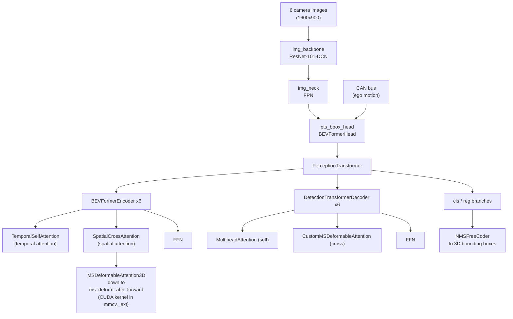
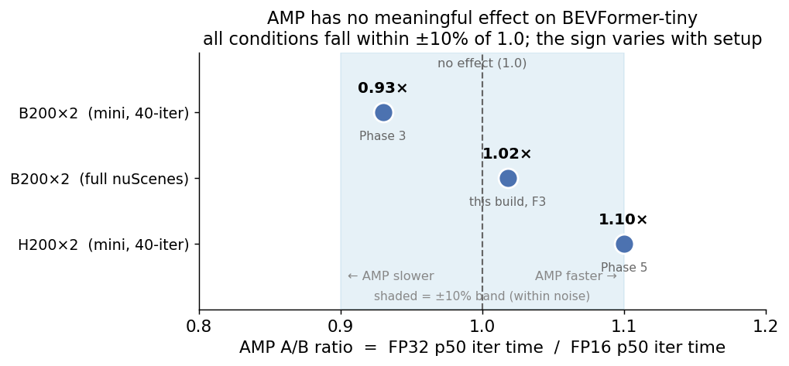
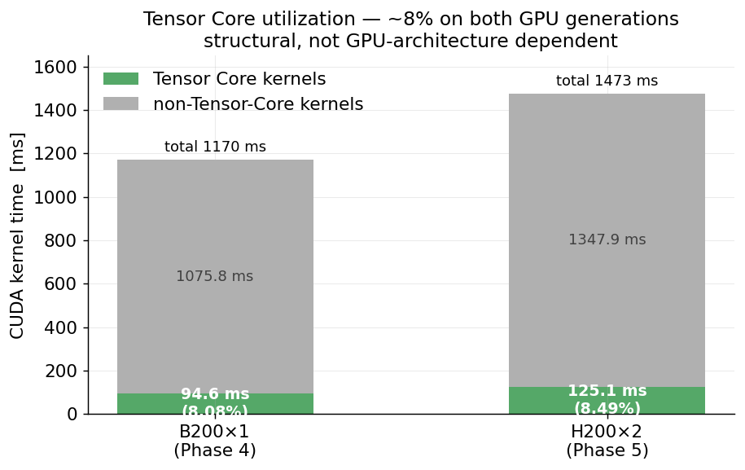
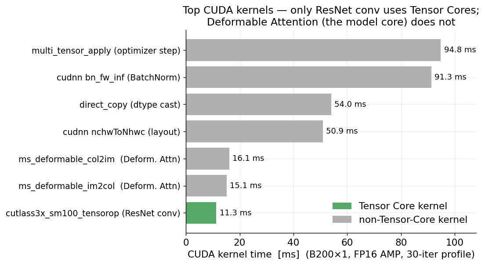

# BEVFormer on NVIDIA Blackwell B200 / Hopper H200

**A reproducible PyTorch 2.8 + CUDA 12.8 + Blackwell (sm_100) build of BEVFormer (ECCV 2022), plus a performance analysis of why a 2022 autonomous-driving model does *not* get much faster on the latest GPUs.**

- **License**: Apache 2.0
- **Verified on**: B200×2 / B200×1 (Blackwell, sm_100), H200×2 (Hopper, sm_90)
- **Docker image**: `nabe2030/bevformer:blackwell-pt2.8` (Docker Hub)
- **Key contribution**: `SimpleDDP`, a ~14-line reimplementation of mmcv 1.x's distributed wrapper that runs on PyTorch 2.x

---

## What you'll find here

- How to run the 2022 BEVFormer codebase on PyTorch 2.8 + CUDA 12.8 + Python 3.11 + Blackwell GPUs
- A fix for the long-standing problem that mmcv 1.x does not run on PyTorch 2.x (`SimpleDDP`)
- A measured performance characterization of BEVFormer-tiny on the latest GPUs (why Tensor Cores are barely used)
- Empirical data for GPU investment decisions on autonomous-driving models

The `SimpleDDP` fix should apply to other mmcv 1.x based autonomous-driving models as well (BEVDet, StreamPETR, UniAD, Sparse4D, etc.).

---

## What is BEVFormer?

BEVFormer (Bird's-Eye-View Former) is a Transformer-based model that builds a **Bird's-Eye-View (BEV) spatial representation** from multiple vehicle-mounted cameras and performs 3D object detection (Li et al., ECCV 2022).

The basic flow:

- Capture images from **6 cameras** around the vehicle (front, front-left/right, back, back-left/right; 1600×900 each)
- Extract features from each image with a CNN (ResNet)
- Prepare a grid of **BEV queries** corresponding to points on the ground plane around the vehicle (e.g. 200×200)
- Each BEV query attends to the multi-camera image features (**spatial attention**) to build a 3D-aware representation
- Each BEV query also attends to the **previous timestep's BEV** (**temporal attention**) to capture moving objects
- The resulting BEV representation is decoded into 3D bounding boxes

The core of both spatial and temporal attention is **Deformable Attention**, which turns out to be the key to the performance analysis below.

---

## Architecture and key libraries

### Model structure

BEVFormer is implemented as an OpenMMLab `mmdet3d` plugin. The main call chain at inference time:



Highlights:

- **Image features**: ResNet-101-DCN backbone + FPN neck
- **BEV construction**: 6 stacked BEVFormerEncoder layers; each does TemporalSelfAttention -> SpatialCrossAttention -> FFN
- **Detection**: 6 stacked DetectionTransformerDecoder layers, regressing 3D boxes from 900 object queries
- **Deformable Attention** is at the core of both spatial and temporal attention

### Key libraries and their roles

| Library | Version | Role |
|---|---|---|
| PyTorch | 2.8.0.dev+cu128 | DL framework |
| CUDA | 12.8 | GPU compute (required for Blackwell sm_100) |
| mmcv-full | 1.7.2 (source build) | OpenMMLab foundation (registry / config / DDP / CUDA ops). **The Deformable Attention CUDA kernel lives here** |
| mmdet | 2.28.2 | 2D detection framework |
| mmdet3d | 0.17.1 | 3D detection framework. BEVFormer is hard-pinned to this version |
| mmseg | 0.30.0 | segmentation components |
| BEVFormer plugin | (model code) | `projects/mmdet3d_plugin/`, 88 Python files |

Note: **the BEVFormer repository itself contains no CUDA / C++ source (`.cu` / `.cpp`) files.** All CUDA operations rely on precompiled extensions in mmcv-full / mmdet3d. The Deformable Attention CUDA kernel (`ms_deform_attn_forward`) discussed below lives in **mmcv-full (`mmcv._ext`)**; BEVFormer loads it via `ext_loader.load_ext('_ext', [...])`.

---

## Key findings

BEVFormer's official training scripts assume **distributed training across 8 GPUs** (data-center GPUs of the 2022 era, V100 / A100 generation). When moving this to the latest H200 / B200 in 2026, the naive expectation is "a newer, more powerful GPU should make training much faster" — especially if AMP (Automatic Mixed Precision, which speeds up LLM training) and Blackwell's powerful Tensor Cores can be leveraged.

So we started from the question: **"If we put BEVFormer-tiny on a B200, does training get much faster?"**

Measurements are based on the **median (p50) wall-clock time per training iteration** (mini batch, samples_per_gpu=1). The result: enabling AMP barely changed the iteration time, and Tensor Core utilization was extremely low (~8%). This repository shows why, with measured data.

| Metric | Result | Conclusion |
|---|---|---|
| AMP A/B ratio (FP32 / FP16, p50 iter time) | 0.93× – 1.10× across conditions (≈1.0) | no meaningful effect |
| Tensor Core kernel time ratio | 8.08% (B200) / 8.49% (H200) | structural, GPU-generation-independent |
| DDP correctness | monotone convergence with SimpleDDP on both B200×2 and H200×2 | the wrapper works |

(The AMP A/B ratio is "FP32 p50 iter time / FP16 p50 iter time." Above 1.0 means AMP is faster, below means slower. Across the conditions we measured it sits within ±10% of 1.0, with the sign varying by dataset/GPU — i.e., within noise.)

Takeaways:

- **BEVFormer-tiny's Tensor Core utilization stays around 8%**: its core computation, Deformable Attention, performs **sparse sampling and bilinear interpolation** rather than the dense matrix multiply that Tensor Cores accelerate
- **AMP gives no meaningful speedup**: across B200/H200 and mini/full data, the AMP A/B ratio stays within ±10% of 1.0 and even changes sign with the setup. AMP neither clearly helps nor clearly hurts — consistent with the structural reason above (the dominant op is memory-bound, so FP16 cannot unlock the large speedups it gives matmul-heavy models like LLMs)
- **Upgrading the GPU generation (H200 -> B200) does not yield a large speedup**: the bottleneck is not GPU compute capability but the computational nature of the kernel

---

## Charts

### AMP has no meaningful effect



Across every condition we measured — B200 and H200, mini and full nuScenes — the AMP A/B ratio stays within ±10% of 1.0, and the sign even flips with the setup (0.93× on B200 mini, 1.02× on B200 full, 1.10× on H200 mini). In other words, AMP is neither reliably faster nor reliably slower for BEVFormer-tiny; the effect is within noise. AMP is not "always faster."

### Tensor Core utilization is ~8% on both GPU generations



Aggregating kernel time with torch.profiler, the fraction of time spent in Tensor Core kernels is 8.08% on B200 and 8.49% on H200 — both low, and nearly identical. This indicates a structural property that does not depend on the GPU generation.

### Only the ResNet conv uses Tensor Cores



Breaking down kernel time, the only Tensor Core kernel is the ResNet backbone convolution (cutlass tensorop). BEVFormer's core, Deformable Attention (`ms_deformable_im2col` / `col2im`), does not use Tensor Cores.

---

## Quick Start

### Prerequisites

- Docker + NVIDIA Container Toolkit
- NVIDIA GPU: Hopper (H100 / H200, sm_90) or Blackwell (B100 / B200, sm_100)
- nuScenes dataset, prepared per BEVFormer's instructions (see below)

### Pull the image

```bash
docker pull nabe2030/bevformer:blackwell-pt2.8
```

> **Portability note**: the image is built on top of the `runpod/pytorch` base image and assumes `/workspace` as its working/data location. It is expected to run in any Docker environment with the NVIDIA Container Toolkit and an sm_90 / sm_100 GPU, but it has only been verified on RunPod. The base layer is also published separately as `nabe2030/bevformer:blackwell-base` (see [Docker image composition](#docker-image-composition)).

### Prepare nuScenes

Prepare nuScenes following the [official BEVFormer data preparation](https://github.com/fundamentalvision/BEVFormer/blob/master/docs/prepare_dataset.md). The configs expect the data under `data/nuscenes/` with the info files `nuscenes_infos_temporal_train.pkl` and `nuscenes_infos_temporal_val.pkl` (generated by BEVFormer's `tools/create_data.py`). Mount that directory at `/workspace/data/nuscenes`.

> All commands below run with **`cd /workspace`** and **`PYTHONPATH=/opt/bevformer`**. The working directory must be `/workspace` because the configs reference the data with a relative path (`data_root='data/nuscenes/'`); the tools, configs, and scripts themselves live at absolute paths under `/opt/bevformer`.

### Run a minimal training

```bash
docker run --gpus all --rm \
  -v /path/to/nuscenes:/workspace/data/nuscenes \
  -v /path/to/output:/workspace/runs \
  nabe2030/bevformer:blackwell-pt2.8 \
  bash -c "cd /workspace && PYTHONPATH=/opt/bevformer \
    bash /opt/bevformer/tools/dist_train.sh \
      /opt/bevformer/projects/configs/bevformer/bevformer_tiny.py 2 \
      --no-validate --work-dir /workspace/runs/test"
```

`2` is the number of GPUs. `--no-validate` skips the periodic evaluation (useful for a quick smoke run).

### Reproducing the benchmarks

All of the benchmark and profiling helpers are baked into the image under `/opt/bevformer/scripts/` and `/opt/bevformer/projects/configs/bevformer/`, so no extra mounts are needed beyond the data and output directories.

**AMP A/B benchmark** — measures FP32 vs FP16 (AMP) per-iteration time. The script sets its own working directory and `PYTHONPATH`:

```bash
docker run --gpus all --rm \
  -v /path/to/nuscenes:/workspace/data/nuscenes \
  -v /path/to/output:/workspace/runs \
  nabe2030/bevformer:blackwell-pt2.8 \
  bash /opt/bevformer/scripts/run_amp_benchmark.sh --runs A,B --skip-ncu
```

**Tensor Core utilization** — generate a profiler trace, then aggregate it:

```bash
# 1) generate a torch.profiler trace
docker run --gpus all --rm \
  -v /path/to/nuscenes:/workspace/data/nuscenes \
  -v /path/to/output:/workspace/runs \
  nabe2030/bevformer:blackwell-pt2.8 \
  bash -c "cd /workspace && PYTHONPATH=/opt/bevformer \
    python /opt/bevformer/tools/train.py \
      /opt/bevformer/projects/configs/bevformer/bevformer_tiny_profile.py \
      --no-validate --work-dir /workspace/runs/profile"
```

```bash
# 2) aggregate the Tensor Core ratio from the trace
docker run --gpus all --rm \
  -v /path/to/output:/workspace/runs \
  nabe2030/bevformer:blackwell-pt2.8 \
  python /opt/bevformer/scripts/tensor_core_ratio.py \
    /workspace/runs/profile/torch_profile/*.pt.trace.json
```

`tensor_core_ratio.py` classifies each CUDA kernel as Tensor-Core or non-Tensor-Core by name and reports the time breakdown (this is how the ~8% figure was obtained). It is pure Python 3 with no torch dependency, so you can also run it on the host directly against the trace file.

---

## SimpleDDP — running mmcv 1.x on PyTorch 2.x

### Why mmcv 1.x does not run on PyTorch 2.x

BEVFormer depends on the older OpenMMLab generation (mmcv 1.x / mmdet 2.x / mmdet3d 0.x). Of these, `mmcv.parallel.MMDistributedDataParallel`, which handles distributed training, does not work on PyTorch 2.x.

The cause: mmcv 1.x's DDP wrapper directly accesses the **internal (private) APIs** of PyTorch's `DistributedDataParallel`. Specifically, it relies on underscore-prefixed methods and attributes that are not meant for external use:

- `self.reducer._rebuild_buckets()` / `self.reducer._sync_params()`
- `self._module_copies` / `self.parallel_apply()`
- `self._use_replicated_tensor_module`

PyTorch changes or removes these private APIs between versions without notice. In fact, they were progressively removed across PyTorch 1.11 -> 2.0 -> 2.8.

Meanwhile, mmcv 1.x kept its dependence on these private APIs while maintenance moved to mmcv 2.x (a re-architected version based on mmengine). As a result, **projects depending on mmcv 1.x are stranded, unable to move to PyTorch 2.x.** That is the backlog.

Many autonomous-driving models, including BEVFormer (2022), BEVDet, UniAD, StreamPETR, and Sparse4D, depend on this mmcv 1.x and are affected by the same problem. Related GitHub issues have accumulated over five years (pytorch/pytorch #47050, open-mmlab/mmcv #636, and others), but we found no published fix.

### The fix

We reimplemented `MMDistributedDataParallel` without touching any PyTorch private API. The idea: subclass the stock `DistributedDataParallel`, and in `train_step` / `val_step` use mmcv's own `scatter_kwargs` to unwrap the `DataContainer` inputs, then call `self.module.train_step` / `val_step` directly. Gradient synchronization still happens through the parameter hooks that DDP registers in its `__init__`, so there is no need to route through `forward()` at all.

```python
from torch.nn.parallel.distributed import (
    DistributedDataParallel,
    _find_tensors,  # re-exported for downstream mmcv imports
)
from .scatter_gather import scatter_kwargs


class MMDistributedDataParallel(DistributedDataParallel):
    """mmcv 1.7.2 MMDistributedDataParallel, reimplemented for PyTorch 2.x.

    DataContainer is unwrapped via mmcv's own scatter_kwargs (which knows how
    to handle it); then we call self.module.<method> directly. Gradient sync
    still works through the parameter hooks set in DDP __init__.
    """

    def train_step(self, *inputs, **kwargs):
        if self.device_ids:
            inputs, kwargs = scatter_kwargs(inputs, kwargs, self.device_ids, dim=self.dim)
            return self.module.train_step(*inputs[0], **kwargs[0])
        return self.module.train_step(*inputs, **kwargs)

    def val_step(self, *inputs, **kwargs):
        if self.device_ids:
            inputs, kwargs = scatter_kwargs(inputs, kwargs, self.device_ids, dim=self.dim)
            return self.module.val_step(*inputs[0], **kwargs[0])
        return self.module.val_step(*inputs, **kwargs)
```

Properties:

- Touches no PyTorch private API (expected to work on any PyTorch 2.x / 3.x version)
- `scatter_kwargs` is mmcv's own scatter that understands `DataContainer`, so the inputs are unwrapped correctly before reaching the model
- Gradient synchronization still works: DDP installs autograd hooks on the parameters in `__init__`, and those fire during `backward()` regardless of how `forward`/`train_step` was invoked
- No `forward` monkey-patching and no `try/finally` restore — the call goes straight to `self.module.train_step`

This is the result of three iterations: a v1 "swap `forward`" approach hit a `TypeError` (PyTorch 2.x's `_pre_forward` unpacked the dict args), a v2 "bypass forward" approach skipped the `DataContainer` unwrap (`'DataContainer' is not subscriptable`), and this v3 — `scatter_kwargs` + direct call — is the one that works. The full implementation is in [`patches/bevformer/16_simple_ddp_wrapper.sh`](./patches/bevformer/16_simple_ddp_wrapper.sh).

### Verification

On B200×2, multi-GPU training runs completed with the loss decreasing monotonically (e.g. 20.63 → 14.14 over 2000+ iterations, and 23.26 → 16.34 in an earlier 3-epoch run), with no NaN / divergence and a stable gradient norm. The same image also runs on H200×2. Because the cross-rank gradient synchronization runs hundreds to thousands of times in these runs without diverging, the parameter-hook-based sync of this `SimpleDDP` is confirmed to work correctly across both GPU generations.

---

## Docker image composition

> **Two-stage build.** The image is built in two layers. `docker/Dockerfile.blackwell-base` does the heavy lifting — the RunPod base plus source builds of mmcv-full and mmdet3d — and produces the base image, published as `nabe2030/bevformer:blackwell-base`. `docker/Dockerfile.blackwell-pt2.8` then builds `FROM` that published base and bakes in the Strategy C1 patches (the `SimpleDDP` wrapper, single-GPU test support, and the benchmark/profiling scripts and configs), producing the image you pull in the Quick Start, `nabe2030/bevformer:blackwell-pt2.8`.
>
> The release Dockerfile is self-contained and builds from this repository directly: `docker build -f docker/Dockerfile.blackwell-pt2.8 .` (run from the repo root) pulls the published base and copies in the repo's artifacts. The base Dockerfile is included for reference/transparency — it builds from the upstream BEVFormer source tree (not vendored here), and its output is the published `blackwell-base` image that the release pulls. So in practice you never need to rebuild the base: `docker pull` of `blackwell-pt2.8` already contains everything.

### Why this base image

The base is `runpod/pytorch:2.8.0-py3.11-cuda12.8.1-cudnn-devel-ubuntu22.04`. This is a deliberate choice after trial and error: using `nvidia/cuda` directly as the base led to the container entering a restart loop on the Pod (the `runpod/pytorch` base's startup script needs to be inherited).

### Stack

| Component | Version |
|---|---|
| PyTorch | 2.8.0.dev+cu128 |
| CUDA | 12.8 |
| Python | 3.11 |
| numpy / numba | 1.26.4 / 0.58.1 (pinned) |
| mmcv-full | 1.7.2 (source build, `MMCV_WITH_OPS=1`) |
| mmdet / mmdet3d / mmseg | 2.28.2 / 0.17.1 / 0.30.0 |
| TORCH_CUDA_ARCH_LIST | `"9.0;10.0"` (Hopper + Blackwell) |

Design notes:

- mmcv-full **must be a source build** (PyPI wheels lack the sm_90 / sm_100 CUDA cubins)
- mmdet3d 0.17.1 is hard-pinned by BEVFormer (newer versions are plugin-API-incompatible); it is cloned, patched, and source-built
- numpy / numba are pinned via `PIP_CONSTRAINT` (to prevent nuscenes-devkit from silently upgrading numpy to 2.x)
- the Docker image is built with `--provenance=false --sbom=false` (BuildKit 29.x defaults to generating an OCI Image Index + attestation manifest, which is incompatible with some image pullers)

### Compatibility patches

To bridge the 2022 codebase to the modern stack, the `patches/` directory contains a series of compatibility patches. The main ones:

- fixing references to a removed header (`THC/THC.h`) in mmdet3d 0.17.1's C++ extensions
- replacing `np.bool` -> `bool` (removed in numpy 1.26+)
- adapting to PyTorch 2.x DDP API changes
- replacing `MMDistributedDataParallel` with `SimpleDDP` (the core of this repository)

Each patch documents its rationale in a docstring.

---

## Methodology

| Phase | GPU | Purpose |
|---|---|---|
| Phase 3 | NVIDIA B200×2 SECURE (RunPod) | AMP A/B comparison, DDP correctness |
| Phase 4 | NVIDIA B200×1 SECURE (RunPod) | Tensor Core utilization via torch.profiler |
| Phase 5 | NVIDIA H200×2 SECURE (RunPod) | confirm GPU-independence |

- Dataset: nuScenes v1.0-mini (323 samples) for the Phase 3–5 measurements; the AMP benchmark was additionally run on the full nuScenes train set in this build's verification
- Config: `bevformer_tiny.py` (official) + AMP ON/OFF variants (`bevformer_tiny_amp_fp32.py` / `_fp16.py`, which simply inherit `bevformer_tiny.py` and toggle `fp16`)
- Tensor Core utilization measured with `torch.profiler` (NCU was unavailable due to RunPod container permission limits)
  - schedule: `wait=20, warmup=5, active=30, repeat=1`
  - kernel events over 30 active iterations: 242,465 (trace size 668 MB)
  - TC kernel detection: kernel-name pattern matching (`cutlass3x_sm100_tensorop`, `cudnn.*tensorop`, etc. as TC; `elementwise` / `reduce` / `(im|col)2(col|im)` etc. as non-TC)

---

## Detailed results

### AMP A/B

The benchmark was run under several conditions. The per-iteration time is reported as the median (p50) over the timed window.

Phase 3 (B200×2, nuScenes mini, 40-iter window):

| Run | precision | mean iter (s) | p50 (s) | loss first -> last |
|---|---|---|---|---|
| A | FP32 | 0.4785 | 0.3810 | 23.36 -> 18.13 |
| B | FP16 (AMP ON) | 0.5276 | 0.4100 | 23.27 -> 18.22 |

This build (B200×2, full nuScenes train set):

| Run | precision | mean iter (s) | p50 (s) | loss first -> last |
|---|---|---|---|---|
| A | FP32 | 0.3290 | 0.4740 | 20.63 -> 14.14 |
| B | FP16 (AMP ON) | 0.3059 | 0.4655 | 20.80 -> 16.07 |

AMP A/B ratios (FP32 p50 / FP16 p50): **0.93×** (Phase 3, mini), **1.018×** (this build, full), and **1.10×** measured on H200×2 (mini). All sit within ±10% of 1.0, and the sign changes with the setup — i.e., AMP has no meaningful, reliable effect for BEVFormer-tiny.

### Tensor Core ratio (Phase 4, B200×1)

| Category | total kernel time (ms) | share |
|---|---|---|
| Tensor Core kernels | 94.6 | 8.08% |
| non-TC kernels | 1075.8 | 91.92% |
| total | 1170.4 | 100% |

Top kernels:

| Rank | Time (ms) | Kernel | TC? |
|---|---|---|---|
| 1 | 94.8 | multi_tensor_apply (optimizer step) | - |
| 2 | 91.3 | cudnn bn_fw_inf (BatchNorm) | - |
| 3 | 54.0 | direct_copy (dtype cast) | - |
| 17 | 16.1 | ms_deformable_col2im (Deformable Attention) | - |
| 18 | 15.1 | ms_deformable_im2col (Deformable Attention) | - |
| 24 | 11.3 | cutlass3x_sm100_tensorop (ResNet conv) | **TC** |

### H200 vs B200 (Phase 5)

| Metric | B200×2 | B200×1 | H200×2 |
|---|---|---|---|
| AMP A/B ratio (p50) | 0.93× (mini) / 1.02× (full) | — | 1.10× (mini) |
| TC kernel ratio | — | 8.08% | 8.49% |
| dominant non-TC kernel | optimizer step + BatchNorm | (same) | + NCCL AllReduce 23% |

The AMP A/B ratio is within ±10% of 1.0 in every case and changes sign with the setup, so it carries no reliable signal. The Tensor Core ratio, by contrast, is consistently ~8% — that is the robust, GPU-generation-independent result.

On H200×2, NCCL AllReduce accounted for 23% of kernel time. This is because with samples_per_gpu=1 (mini batch), the per-iteration gradient synchronization cost is relatively large; the share should drop with a larger batch. (This is also why the TC ratio is best measured on a single GPU — multi-GPU runs dilute it with communication kernels.)

---

## Why AMP / Tensor Cores don't help

The measured "AMP barely helps" and "Tensor Core utilization stays at ~8%" both have a clear structural explanation.

### Tensor Cores only accelerate dense matrix multiply

NVIDIA Tensor Cores are dedicated units for accelerating **dense matrix multiply (GEMM)**. They are very effective for operations that decompose into large matrix products, such as convolutions and fully-connected layers.

### Deformable Attention is not a matrix multiply

The computation at the core of BEVFormer, Deformable Attention, is essentially:

- for each query, select a small number of sampling points on the image feature map
- at each sampling point, fetch features via **bilinear interpolation** (sparse gather + interpolation)
- take a weighted sum of the fetched features by attention weights

This is dominated by **sparse memory access (gather) and interpolation** and is memory-bandwidth-bound, not a dense matrix multiply. Therefore it **is not in a form that Tensor Cores can accelerate**.

In fact the CUDA kernel (`ms_deform_attn_forward`) ships both an FP16 variant (`MultiScaleDeformableAttnFunction_fp16`) and an FP32 variant, integrated with AMP via the `torch.cuda.amp.custom_fwd` / `custom_bwd` decorators. So with AMP enabled, Deformable Attention does run in FP16. **But even in FP16, since the operation is fundamentally gather + interpolation, Tensor Cores are still not used.**

### This is the flip side of Deformable Attention's design

Interestingly, this is exactly the flip side of what makes Deformable Attention efficient. Deformable Attention avoids dense attention over all positions and instead attends **sparsely to only a few sampling points**, which is how it keeps the computation cheap.

That very sparsity, the source of its efficiency, is also the reason it is structurally incompatible with Tensor Cores, which are built for dense matrix multiply. The efficiency trick is what keeps it from using the latest GPU's compute units.

### Why AMP's effect is small and inconsistent

Switching to FP16 with AMP halves memory bandwidth consumption (FP32 -> FP16). Since Deformable Attention is bandwidth-bound, this saving is in principle a small plus. On the other hand, AMP has overheads: FP32 <-> FP16 casts, loss scaling, and so on. For this model the two roughly cancel, so the net effect is tiny and its sign depends on second-order factors — GPU memory bandwidth, dataset size and data-loading overhead, batch size, and how many warmup iterations are excluded.

That is exactly what we observe: across B200 / H200 and mini / full data the AMP A/B ratio stays within ±10% of 1.0 and flips sign between conditions. None of these are large enough to call a real "speedup" or "slowdown" — they are within the noise you would expect from a near-cancellation. The honest summary is that **AMP makes essentially no difference for BEVFormer-tiny**, which is the expected outcome once you know the dominant op cannot use Tensor Cores.

### FP8 (Transformer Engine) is the same

FP8 via NVIDIA Transformer Engine can be applied to Linear layers, but Deformable Attention does not benefit for the same reason and would require rewriting the CUDA kernel.

---

## Implications for GPU investment

From the measurements, for running BEVFormer-tiny:

- **A speedup from upgrading the GPU generation (H200 -> B200, etc.) was not observed within this study**: iteration time was nearly identical across GPU generations, with only AMP flipping the ordering. The bottleneck appears to be the computational nature of Deformable Attention (bandwidth-bound, not Tensor-Core-friendly), not GPU compute capability
- **GPU investment should be evaluated as "model + kernel + GPU" together**: a simple hardware-spec comparison can mislead the ROI estimate
- **For just running BEVFormer-tiny as-is, choosing the cost-effective GPU is the practical answer**: when performance is roughly equal, pick by cost efficiency

---

## What we'd like to try next — rewriting the Deformable Attention CUDA kernel

What this study showed is the concrete fact that **moving BEVFormer-tiny onto the latest H200 / B200 GPUs barely sped up training.** The cause was that the core Deformable Attention uses an operation (sparse gather + interpolation) that does not use Tensor Cores.

A natural next step would be to **rewrite the Deformable Attention CUDA kernel itself into a form that can use Tensor Cores / FP8.** However, whether that actually makes things faster, and by how much, is **untested.** There is precedent for putting sparse attention onto Tensor Cores (e.g. Flash Attention), so it does not seem impossible, but how far Deformable Attention's interpolation can be reshaped to be Tensor-Core-friendly is something we won't know until we try.

This CUDA kernel lives in mmcv-full (`mmcv._ext`), not in BEVFormer itself, so the rewrite target would be the mmcv-side kernel. We plan to explore this in a separate repository (with the outcome to be determined by actually doing it).

---

## Related work and references

- BEVFormer (ECCV 2022): https://arxiv.org/abs/2203.17270
- Fundamental-Vision / BEVFormer (official): https://github.com/fundamentalvision/BEVFormer
- OpenMMLab / mmcv: https://github.com/open-mmlab/mmcv
- Flash Attention (Dao et al. 2022): https://arxiv.org/abs/2205.14135
- NVIDIA Transformer Engine: https://github.com/NVIDIA/TransformerEngine

Related issues (mmcv 1.x vs PyTorch 2.x compatibility):

- pytorch/pytorch #47050
- open-mmlab/mmcv #636, #1629, #1754, #3168
- microsoft/Cream #179

---

## Citation

```bibtex
@misc{bevformer-blackwell-2026,
  title  = {BEVFormer on NVIDIA Blackwell B200 / Hopper H200:
            A Reproducible PyTorch 2.8 Build with SimpleDDP and Performance Analysis},
  author = {Watanabe, Makoto},
  year   = {2026},
  url    = {https://github.com/nabe2030/bevformer-blackwell},
  note   = {Verified on NVIDIA B200 (sm\_100) and H200 (sm\_90)}
}
```

---

## License

Apache License 2.0 (see [LICENSE](./LICENSE)).

This repository contains derivative work (patches, etc.) based on the following upstream projects, each under Apache 2.0; their original copyright and license terms apply:

- BEVFormer (fundamental-vision/BEVFormer)
- mmcv / mmdet / mmdet3d / mmseg (open-mmlab)

---

## Acknowledgments

- The BEVFormer team for the original implementation
- The OpenMMLab team for the mmcv / mmdet3d ecosystem
- Those who made Blackwell B200 / Hopper H200 hardware accessible via RunPod
- Anthropic Claude Code was used for investigating the compatibility issues, source analysis, and exploring the SimpleDDP design
